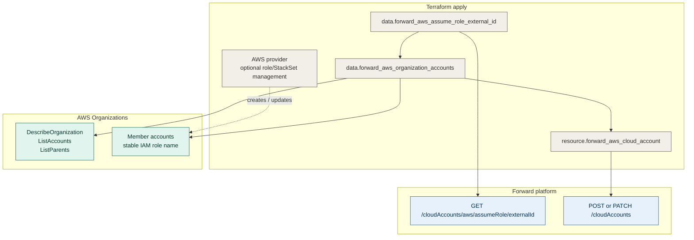

# Terraform Provider Forward Enterprise

This repository contains the Terraform provider for [Forward Networks](https://www.forwardnetworks.com). The provider is built with the [Terraform Plugin Framework](https://github.com/hashicorp/terraform-plugin-framework).

The provider currently supports Forward Basic authentication, network and proxy management, AWS and Azure cloud account onboarding (including AWS Organizations), collector attachment, snapshot and NQE workflows, intent checks, path analysis, and an NQE library query resource for publishing queries to the org library.

## Building against the Forward Go SDK

The provider depends on `github.com/forwardnetworks/forward-go-sdk`. While that module is hosted internally rather
than on GitHub, Go needs to be told where to fetch it from. The module keeps its eventual public path, so this is
two lines of local configuration rather than a `replace` directive or a rename that would have to be undone:

```sh
go env -w GOPRIVATE='github.com/forwardnetworks/*'
git config --global \
  url."https://gerrit.local.forwardnetworks.com/a/forward-go-sdk".insteadOf \
  "https://github.com/forwardnetworks/forward-go-sdk"
```

Remove both once the SDK is published; nothing in this repository changes.

## Native IaC Workflow

For AWS Organizations, this provider is the native Infrastructure as Code path. Terraform can prepare the AWS-side roles with the AWS provider, discover active AWS Organization accounts with this provider, and create or update the Forward AWS cloud setup with this provider.

Use this path when:

- AWS accounts are managed through AWS Organizations.
- Every collected account has the same Forward collection IAM role name.
- Forward uses one of the supported AWS collection credential models: Forward assume-role, static collector keys, or collector instance profile.
- You want Terraform plan/apply to show account additions and removals before Forward is updated.

The JSON/manual-upload workflow remains useful for review or break-glass operations, but it is not required for the normal IaC workflow.

## Quick Start

```hcl
terraform {
  required_providers {
    forward = {
      source = "forwardnetworks/forward"
    }
  }
}

provider "forward" {
  base_url   = var.forward_base_url
  network_id = var.forward_network_id
  username   = var.forward_username
  password   = var.forward_password
}
```

Provider inputs can be supplied directly or with environment variables:

```shell
export FORWARD_BASE_URL=https://fwd.app
export FORWARD_NETWORK_ID=123456
export FORWARD_USERNAME=you@example.com
export FORWARD_PASSWORD='secret'
```

## Native AWS Organization Onboarding

The AWS organization workflow uses two data sources and one resource:

- `forward_aws_assume_role_external_id` fetches the Forward-generated external ID.
- `forward_aws_organization_accounts` uses the AWS SDK credential chain to call AWS Organizations and build Forward `assume_role_infos`.
- `forward_aws_cloud_account` creates or patches the Forward AWS cloud setup.

This is a Terraform-native workflow for AWS Organizations onboarding when every collected AWS account has the same IAM role name. Terraform can use the AWS provider to deploy that role, this provider can read AWS Organizations, and this provider can create or update the Forward AWS setup. The legacy JSON/manual-upload workflow remains useful for break-glass review, but it is no longer required for the normal Organizations path.



Example:

```hcl
data "forward_aws_assume_role_external_id" "current" {}

data "forward_aws_organization_accounts" "current" {
  role_name   = "ForwardNetworksReadOnly"
  external_id = data.forward_aws_assume_role_external_id.current.external_id
  aws_profile = "org-readonly"
}

resource "forward_aws_cloud_account" "organization" {
  name    = "production-aws"
  collect = true
  regions = ["us-east-1", "us-west-2"]

  credential_mode = "forward-assume-role"

  assume_role_infos = data.forward_aws_organization_accounts.current.assume_role_infos
}
```

The AWS credentials used by Terraform need read-only Organizations permissions:

- `organizations:DescribeOrganization`
- `organizations:ListAccounts`
- `organizations:ListParents`

`forward_aws_organization_accounts` fails if these calls do not succeed. That is intentional: a partial AWS account list could cause a Forward update that drops accounts from collection.

If a Forward AWS setup with the same name already exists, `forward_aws_cloud_account` patches that setup instead of creating a duplicate. By default it refuses to remove existing AWS account entries from a setup; set `allow_account_removals = true` only after reviewing a Terraform plan where those removals are intentional.

The Forward resource defaults `delete_on_destroy` to `false`. Destroying the Terraform resource removes it from state but does not delete the Forward cloud setup unless `delete_on_destroy = true` is explicitly set.

See [guides/aws-organization-onboarding.md](guides/aws-organization-onboarding.md) for the full workflow and [examples/aws-organization-onboarding](examples/aws-organization-onboarding) for a runnable configuration.

### AWS Collection Credential Modes

`credential_mode` selects how Forward gets the base AWS credentials used to assume the per-account role ARNs in `assume_role_infos`:

- `forward-assume-role`: Forward's AWS account assumes the member-account roles. Use `forward_aws_assume_role_external_id` and configure AWS trust policies with that external ID. This is the default and preferred SaaS workflow.
- `static-keys`: Terraform sends an AWS access key ID and secret access key to Forward. Forward stores those credentials and uses them to assume the member-account roles. Use this for on-prem deployments that require static IAM keys.
- `instance-profile`: Terraform sends no AWS access keys to Forward. The collector uses the AWS SDK default credential chain, typically the EC2 instance profile attached to the collector, to assume the member-account roles.

Static-key mode stores sensitive AWS collector credentials in Forward and in Terraform state. Mark variables as sensitive, source them from runtime secret storage, and use protected encrypted remote state.

## Requirements

- [Terraform](https://developer.hashicorp.com/terraform/downloads) >= 1.0
- [Go](https://go.dev/dl/) >= 1.24

## Building the Provider

```shell
go install ./...
```

The compiled binary is placed in `$GOBIN`, or `$(go env GOPATH)/bin` when `$GOBIN` is unset.

For local development, point Terraform at the locally built provider with a CLI config dev override:

```hcl
provider_installation {
  dev_overrides {
    "forwardnetworks/forward" = "/Users/you/go/bin"
  }
  direct {}
}
```

See [guides/installation.md](guides/installation.md) for local build and GitHub release binary installation options before Terraform Registry publishing.

## Developing the Provider

```shell
go test ./...
make generate
make testacc
```

`make generate` refreshes provider docs from schema and examples. `make testacc` runs acceptance tests and may call live services depending on the test.

## Available Resources

- `forward_aws_cloud_account` — creates or patches a Forward AWS cloud account setup.
- `forward_intent_check` — manages intent checks tied to a snapshot.
- `forward_nqe_query_definition` — references NQE library entries for intent and query metadata.
- `forward_snapshot` — captures and tracks Forward Enterprise snapshots.

## Available Data Sources

- `forward_aws_assume_role_external_id` — retrieves the Forward-generated AWS assume-role external ID.
- `forward_aws_organization_accounts` — discovers AWS Organizations accounts and builds Forward assume-role entries.
- `forward_intent_checks` — reports intent check pass/fail status for a snapshot.
- `forward_nqe_query` — executes NQE queries and returns JSON-formatted results.
- `forward_path_analysis` — executes path analysis queries and returns hop-level outcomes.
- `forward_snapshots` — lists snapshots for the configured network with optional filters.
- `forward_version` — exposes deployment build, release, and version metadata.

## Examples

- [AWS Organization Onboarding](examples/aws-organization-onboarding)
- [Pre/Post Change Validation](examples/pre-post)

## Workflow Guides

- [Native AWS Workflow](guides/native-aws-workflow.md)
- [Native IaC AWS Organization Onboarding](guides/aws-organization-onboarding.md)
- [Installation Before Registry Publishing](guides/installation.md)

## Release

1. Update `CHANGELOG.md` with the new version notes.
2. Run `goreleaser release --snapshot --skip-publish` to verify artifacts locally.
3. Tag the release.
4. Run `goreleaser release` with appropriate credentials to publish binaries and checksums.
5. Publish the release to the Terraform Registry when registry distribution is ready.
