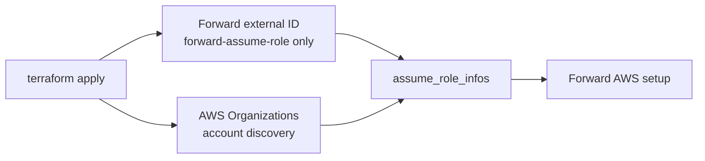

# Native IaC AWS Organization Onboarding

This example creates or updates a Forward AWS cloud account setup from AWS Organizations data using Terraform as the native IaC workflow.

The workflow is fully Terraform-native for all three Forward AWS Organizations collection models:

1. Terraform reads the Forward-generated external ID.
2. Terraform uses AWS SDK credentials to read AWS Organizations.
3. Terraform builds one `assume_role_infos` entry per active AWS account using a stable role name.
4. Terraform creates or patches the Forward AWS cloud setup.

Set `forward_credential_mode` to:

- `forward-assume-role`: Forward's AWS account assumes the member-account roles. This is the default.
- `static-keys`: Forward stores an AWS access key ID and secret access key, then uses that key to assume member-account roles.
- `instance-profile`: Forward stores no AWS keys; the collector uses its AWS SDK default credential provider, usually an EC2 instance profile.



## Usage

```bash
cp terraform.tfvars.example terraform.tfvars
terraform init
terraform plan
terraform apply
```

The AWS credentials used by Terraform must be able to call:

- `organizations:DescribeOrganization`
- `organizations:ListAccounts`
- `organizations:ListParents`

The collection role named by `forward_collection_role_name` must already exist in the AWS accounts Forward should collect.

For `static-keys`, pass `forward_collector_access_key_id` and `forward_collector_secret_access_key` from runtime secret storage. Terraform state will contain these sensitive values.

For `instance-profile`, ensure the collector's AWS SDK default credential provider can assume the member-account roles.

The resource defaults `delete_on_destroy` to `false`, so a Terraform destroy does not remove the Forward cloud setup unless explicitly configured.
