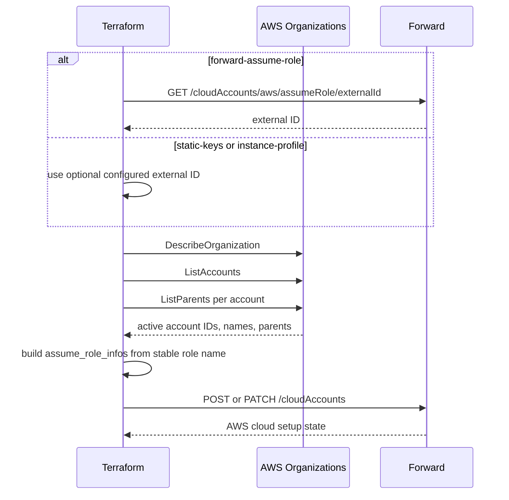

# Native IaC AWS Organization Onboarding

This guide shows the native Terraform workflow for onboarding an AWS Organization into Forward.

The workflow assumes each collected AWS account has the same IAM role name, such as `ForwardNetworksReadOnly`. Terraform may create that role with the AWS provider, while this provider discovers the organization account list and creates or updates the Forward AWS cloud setup.

Forward supports three AWS collection credential models:

- `forward-assume-role`: Forward's AWS account assumes the member-account roles. This is the default SaaS workflow.
- `static-keys`: Forward stores an AWS access key ID and secret access key, then uses those credentials to assume the member-account roles. This is mostly for on-prem deployments that require static IAM keys.
- `instance-profile`: Forward stores no AWS keys. The collector uses the AWS SDK default credential chain, typically the collector EC2 instance profile, to assume the member-account roles.



## Terraform Configuration

```hcl
data "forward_aws_assume_role_external_id" "current" {
  count = var.forward_credential_mode == "forward-assume-role" ? 1 : 0
}

locals {
  assume_role_external_id = var.forward_credential_mode == "forward-assume-role" ? data.forward_aws_assume_role_external_id.current[0].external_id : var.assume_role_external_id
}

data "forward_aws_organization_accounts" "current" {
  role_name   = "ForwardNetworksReadOnly"
  external_id = local.assume_role_external_id
}

resource "forward_aws_cloud_account" "organization" {
  name    = "production-aws"
  collect = true
  regions = ["us-east-1", "us-west-2"]

  credential_mode             = var.forward_credential_mode
  collector_access_key_id     = var.forward_credential_mode == "static-keys" ? var.forward_collector_access_key_id : null
  collector_secret_access_key = var.forward_credential_mode == "static-keys" ? var.forward_collector_secret_access_key : null

  assume_role_infos = data.forward_aws_organization_accounts.current.assume_role_infos
}
```

## Required AWS Permissions

The AWS identity running Terraform needs read-only Organizations permissions:

- `organizations:DescribeOrganization`
- `organizations:ListAccounts`
- `organizations:ListParents`

The data source fails if any of those calls fail. This prevents a partial organization read from producing a Forward account list that could remove accounts from collection.

## Safety Defaults

When a Forward AWS setup with the same name already exists, the provider patches that setup instead of creating a duplicate. This is useful when converting a manually-created setup into Terraform management.

`forward_aws_cloud_account` refuses to remove existing AWS account entries from a Forward setup unless removals are explicitly confirmed:

```hcl
resource "forward_aws_cloud_account" "organization" {
  # ...
  allow_account_removals = true
}
```

Keep `allow_account_removals` unset for normal onboarding and re-runs. Set it only after reviewing a Terraform plan where the removed accounts are expected.

`forward_aws_cloud_account` defaults `delete_on_destroy` to `false`. A Terraform destroy removes the resource from state but does not delete the Forward setup unless the configuration explicitly opts in:

```hcl
resource "forward_aws_cloud_account" "organization" {
  # ...
  delete_on_destroy = true
}
```

## Generated Review Artifacts

The resource exposes `payload_json`, which is the Forward API payload shape. The AWS Organizations data source exposes `manual_account_data_json`, which matches the Forward UI drag-and-drop account upload format.

These are useful for review and break-glass manual workflows, but they are not required for normal Terraform apply.

## Credential Mode Notes

Use `forward-assume-role` when Forward SaaS should assume the collection roles. The member-account role trust policy should include Forward's AWS principal and the external ID returned by `forward_aws_assume_role_external_id`.

Use `static-keys` when an on-prem deployment stores an AWS IAM user's access key in Forward. The key should have only the permissions needed to assume the per-account collection roles. Terraform state will contain the sensitive key material, even when variables are marked sensitive, so use protected encrypted remote state.

Use `instance-profile` when the collector host already has an AWS instance profile or equivalent SDK credential source. In that mode the Forward create payload sets `useForwardAccountToAssumeRole=false` and omits `username` and `password`.
