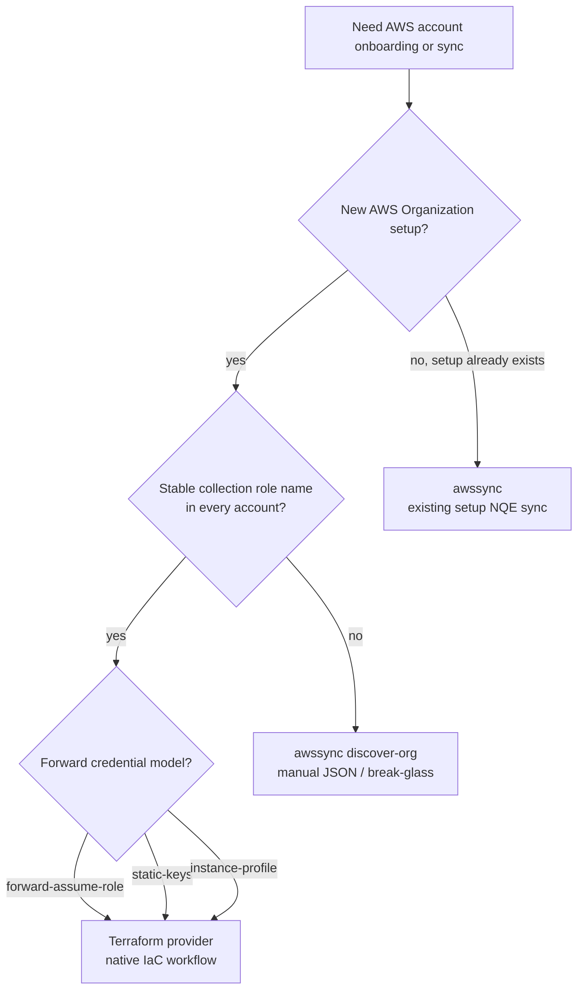

# Native AWS Workflow

Use Terraform as the native IaC workflow for new AWS Organizations onboarding.

Use `awssync` only for existing Forward setup synchronization from NQE data, manual review artifacts, or break-glass onboarding outside Terraform.

## Native Terraform Path

Use:

- `forward_aws_assume_role_external_id`
- `forward_aws_organization_accounts`
- `forward_aws_cloud_account`

This path gives Terraform plan/apply visibility into AWS account additions and removals before Forward is changed.

Set `credential_mode` on `forward_aws_cloud_account`:

- `forward-assume-role`: default SaaS workflow with the Forward-generated external ID.
- `static-keys`: on-prem workflow where Forward stores an AWS access key and secret key.
- `instance-profile`: on-prem workflow where the collector uses its AWS SDK default credential provider, usually an EC2 instance profile.

## awssync Path

Use `awssync` when Forward has already collected the setup and Forward NQE data should drive account-list updates.

Use `awssync discover-org` when you need generated JSON files for manual upload or a create payload that should be reviewed/applied outside Terraform.
